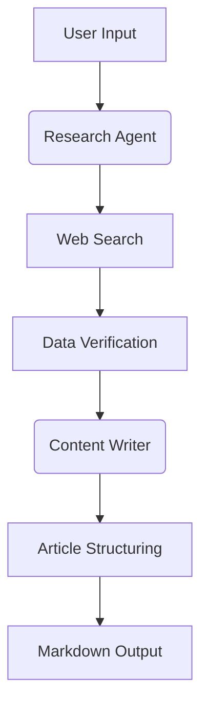

# 🤖 AI News Generator with CrewAI 


**Multi-agent AI system** for automated news article generation with real-time research and professional writing capabilities.

[](https://colab.research.google.com/demo-link)

## 🚀 Key Features

- **Dual-Agent Workflow** 🤝
  - Research Agent: Web research with source verification
  - Writer Agent: Content creation with markdown formatting
- **Real-Time Research** 🔍
  - Integrated SerperDev search tool
  - Source validation and citation management
- **Professional Output** 📄
  - Structured markdown articles
  - Automatic references section
  - Download-ready format

## 🛠️ Installation

```bash
# Clone repository
git clone https://github.com/piktx/ai-news-gen.git
cd ai-news-gen

# Install dependencies
pip install -r requirements.txt

# Set up environment variables
echo "COHERE_API_KEY=your_cohere_key" > .env
echo "SERPER_API_KEY=your_serper_key" >> .env


